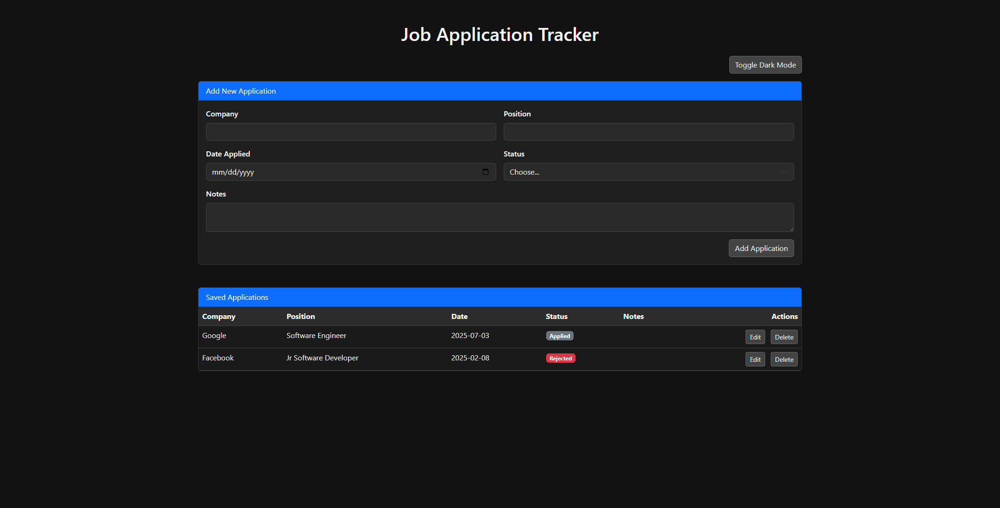
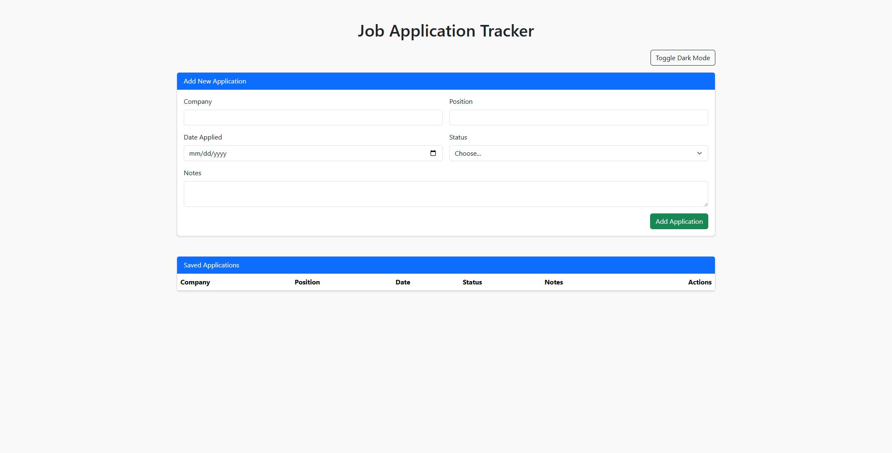
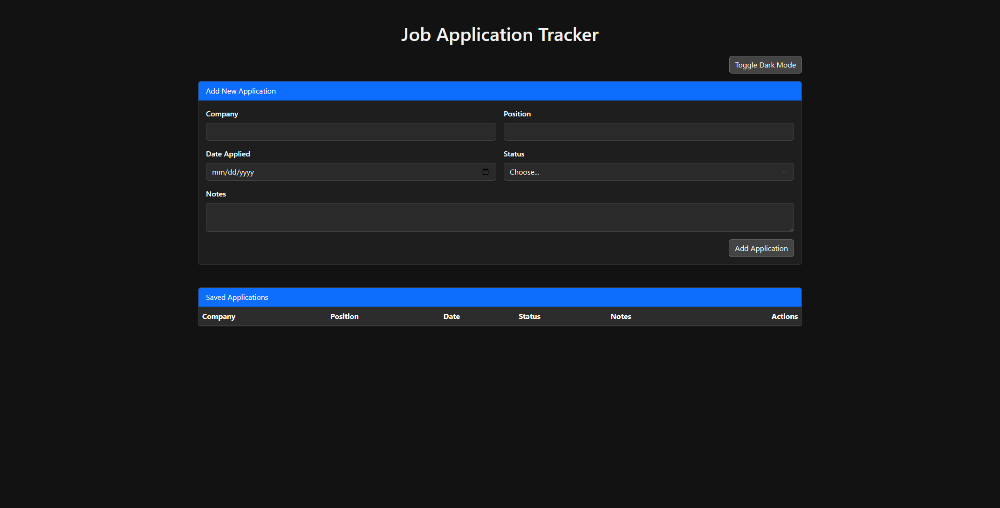

# Job Application Tracker

A clean, responsive web app to track your job applications — built with HTML, CSS, Bootstrap, and JavaScript. Includes dark mode, localStorage support, and CRUD features for managing your applications efficiently.



---

## Features

- Add new job applications with company, role, date, status, and notes
- Edit existing applications inline
- Delete applications with one click
- Data stored in browser via `localStorage`
- Toggle dark mode with one click
- Fully responsive layout using Bootstrap 5

---

## 🚀 Demo

[Live Demo](https://Clank1337.github.io/Job-Tracker/)

---

## 🖼️ Screenshot




---

## Tech Stack

- HTML5
- CSS3
- Bootstrap 5
- JavaScript (Vanilla)
- localStorage API

---

## How to Use

1. Clone the repo:

```bash
git clone https://github.com/Clank1337/job-tracker.git
cd job-tracker
